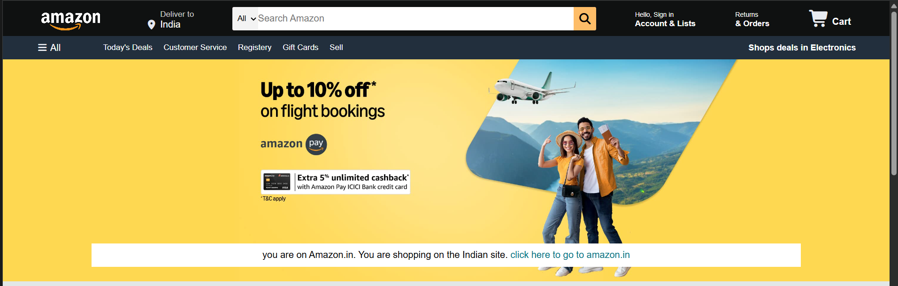
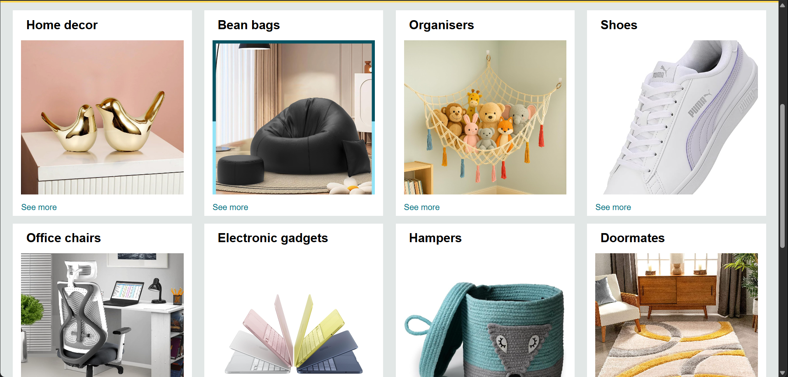
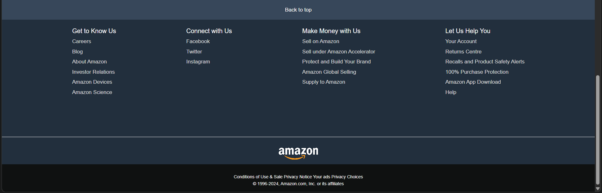

# 🛒 Amazon Clone

A responsive Amazon homepage clone built using only HTML5 and CSS3. This project replicates the design and layout of Amazon's landing page, focusing on modern UI design, responsive layouts, and clean styling without using JavaScript.

## 🚀 Features

* Amazon-inspired homepage design
* Responsive navigation bar
* Hero section with promotional banner
* Product category cards and sections
* Footer similar to Amazon
* Fully built using HTML and CSS
* Clean and organized code structure

## 🛠️ Technologies Used

* HTML5
* CSS3

## 📸 Project Preview

### Homepage

### Product Sections

### Footer & Layout

## 🎯 Learning Outcomes

This project helped me learn:

* HTML page structure
* CSS Flexbox
* CSS Grid
* Responsive Web Design
* Layout Replication
* UI/UX Fundamentals

## 👩‍💻 Author

Sakshi Sharma

B.Tech CSE Student | Aspiring Full Stack Web Developer
